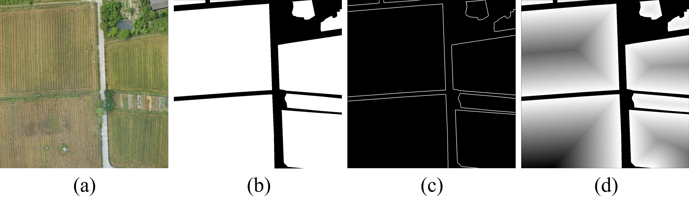
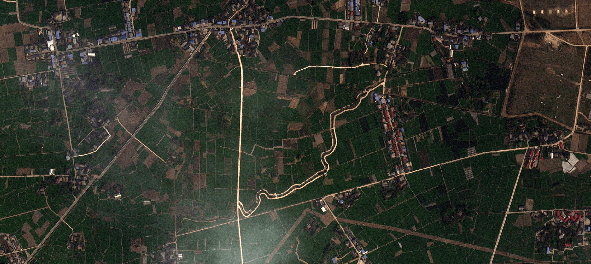
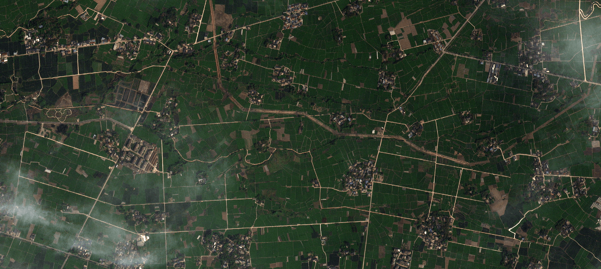
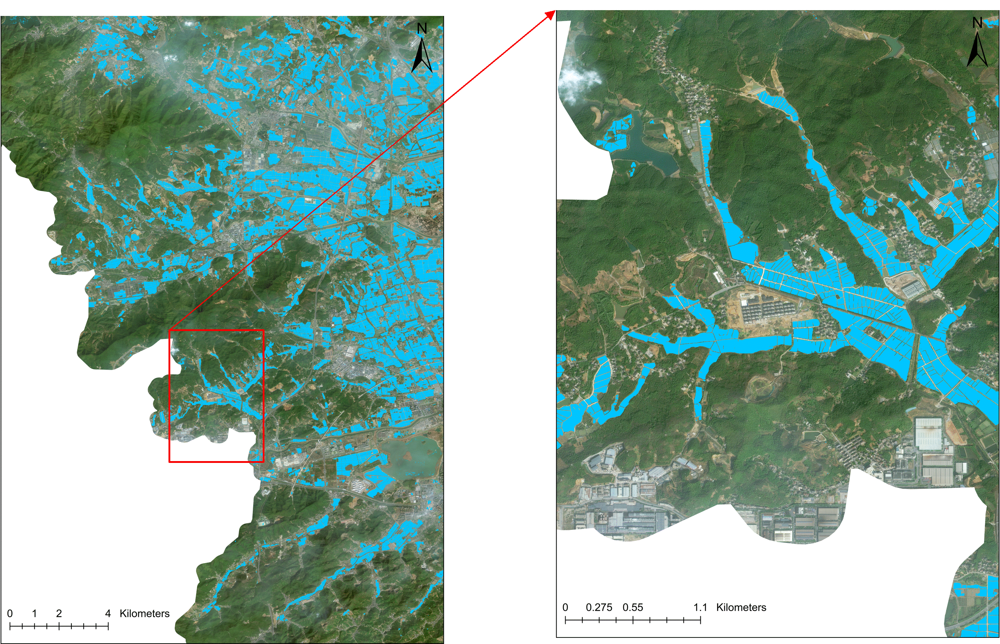
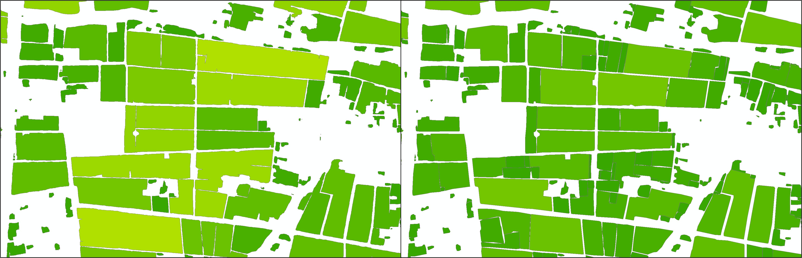

# Farmland_Mapping

EXTRACTING SMALLHOLDER CULTIVATED PARCEL FROM HIGH-RESOLUTION IMAGERY AND SATELLITE IMAGERY

# 1. Data source

4 band satellite image

# 2. How to Make Dataset

The boundary and distance ground truth were generated from a manually labeled parcel mask. The boundary ground truth was obtained from the mask by using the Canny operator. The distance ground truth was obtained in two steps. First, the normalized minimum distance of each non-zero pixel to the nearest zero pixel was calculated using the cv2.distancetransform function of OpenCV. Then, the normalized minimum distance was reversed to enhance the boundary.

The method was proposed by:  [feevos/resuneta: mxnet source code for the resuneta semantic segmentation models](https://github.com/feevos/resuneta)

# 3. The Network

A network that combines multi-task learning and SegFormer.

# 4. Post-processing

Post-processing is crucial, with the following key points to consider:

* **Boundary overlap inference** : Reduce discontinuities caused by cropping.
* **Douglas algorithm for simplification** : Enhance boundary smoothness.
* **Morphological operations** : Completely separate incompletely segmented boundaries or merge partially segmented ones.

# 5. How to Use This Project

- orgnise dataset as "/dataset/dataset_1024X1024_s128" shown.
- run train_base_Single_GPU.py to train
- run inference_FullTiff.py to inference model on a full big tiff image
- some key post-processing method you can find in "PsotProcessing".

# 6. Conclusion

Through my experiments and comparisons, I found that using multispectral imagery for land parcel mapping is a highly effective approach, even outperforming ultra-high-resolution drone imagery. There are two key aspects to consider: first, ensuring boundary representation in network design, and second, applying post-processing for regularization.

# 7. Result

# 8. Finally

This repository contains fragmented code from a large project and hasn't been specifically organized. If anyone is interested in using high-resolution multispectral imagery to map large-scale land parcels, feel free to contact me to collaborate.(Of course its free !!!)
